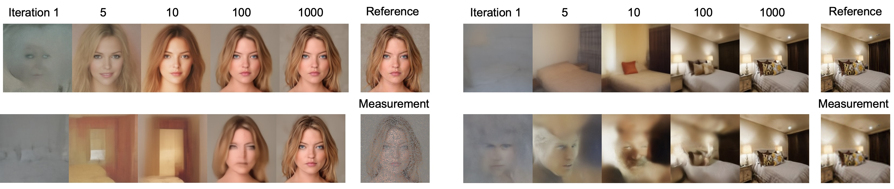

# Weak Diffusion Priors for Inverse Problems



## Environment Setup

Create the Python environment using:

```bash
conda env create -f environment.yml
conda activate weak-diffusion
```

### Nonlinear Deblurring Operator

For nonlinear blur operators, clone the following repository:
```
https://github.com/VinAIResearch/blur-kernel-space-exploring
```

Then follow the instructions in this issue to complete the import:

```
https://github.com/DPS2022/diffusion-posterior-sampling/issues/1
```

## Cross-Domain Inverse Problem Solving

This section evaluates how diffusion priors generalize across domains.

### Relevant Files

* `dps_recon.py` — Diffusion Posterior Sampling (DPS) baseline.
* `weak_recon.py` — Our method.

### Important Arguments

| Argument           | Description                                           |
| ------------------ | ----------------------------------------------------- |
| `--task`           | Inverse problem type (`inpainting`, `gaussian`, etc.) |
| `--dataset`        | Dataset to corrupt (`church`, `celeba`, `bedroom`)    |
| `--model`          | Pretrained diffusion model domain                     |
| `--start`, `--end` | Image index range                                     |
| `--gpu`            | GPU id                                                |

### Example Usage

Run DPS:

```bash
python dps_recon.py --gpu 0 --task inpainting --dataset celeba --model celeba --start 0 --end 1
```

Run our method with cross-domain prior:

```bash
python weak_recon.py --gpu 0 --task inpainting --dataset celeba --model church --start 0 --end 1
```

## Comparison with Optimization-Based Methods

We also compare against optimization-driven plug-and-play approaches.

### Relevant Files

* `dmplug_recon.py` — DMPlug baseline.
* `weak_recon.py` — Our method.

### Example Usage

```bash
python dmplug_recon.py --gpu 0 --task inpainting --dataset celeba --model celeba --start 0 --end 1

python weak_recon.py --gpu 0 --task inpainting --dataset celeba --model celeba --start 0 --end 1
```

## Failure Mode Experiments

To evaluate robustness under extreme corruption, enable box-mask inpainting.

Edit `config/inpainting.yaml` and uncomment:

```yaml
mask_opt:
  mask_type: box
  mask_prob_range: [0.6, 0.6]
  image_size: 256
```

## Latent Diffusion on ImageNet

We include experiments using latent diffusion models and DiT.


### DiT Setup

Clone the DiT repository:

```
https://github.com/facebookresearch/DiT.git
```

Modify the code by replacing:

```python
with th.no_grad():
```

with:

```python
with th.enable_grad() if require_grad else th.no_grad():
```

and add a `require_grad` argument to the corresponding functions.

### Example Usage

Stable diffusion-based reconstruction:

```bash
python stable_recon.py --gpu 0 --task inpainting --dataset ImageNet --start 0 --end 3
```

DiT-based reconstruction:

```bash
python dit_recon.py --gpu 0 --task inpainting --dataset ImageNet --start 0 --end 3
```

### Diffusers DPS Baseline Setup (Stable Diffusion)

To run the latent diffusion DPS baseline, clone the following repository:

```
https://github.com/tongdaxu/diffusers-Diffusion-Posterior-Sampling.git
```

Then copy the following files/directories from this repo into the cloned repository:

* `src/`
* `util/`
* `baseline_recon.py`

After placing them in the cloned repo, run the baseline reconstruction script:

```bash
python baseline_recon.py \
  --data ./ImageNet \
  --out stable_recon/dsg/inpainting \
  --scale 4.8 \
  --algo dps \
  --operator inpainting \
  --nstep 500
```